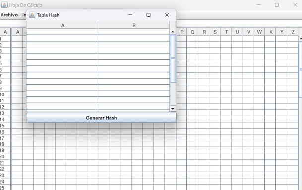
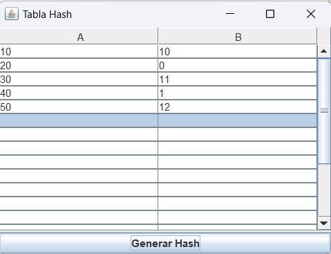

# **Proyecto 3 - Programación III**
---
---
### **Proyecto desarrollado por:**
#### Roberto Antonio Ramirez Gomez 7690-22-12700

#### Jean Klaus Castañeda Santos 7690-22-892

#### Jonathan Joel Chan Cuellar 7690-22-1805
---
[ENLACE A DOCUMENTACION DEL PROYECTO](https://github.com/rramirezg18/Proyecto-3-Programacion-3/blob/main/Documentacion.md)
---
---

# Manual Técnico: Proyecto Hoja de Cálculo

---
---

## Introducción
El presente manual técnico proporciona una descripción exhaustiva del proyecto de Hoja de Cálculo desarrollado por el grupo 3 como parte de un proyecto académico de Programación III. Este manual aborda en detalle la arquitectura del proyecto, sus componentes principales, las funcionalidades implementadas y los requisitos del sistema.

---
---

## Arquitectura del Proyecto
El proyecto está diseñado siguiendo una arquitectura MVC (Modelo-Vista-Controlador) para garantizar una estructura modular y una separación clara de responsabilidades. A continuación, se describen en detalle los principales componentes del proyecto:

---
---
### Clases Principales

---
---

#### `InterfazGrafica`
- **Descripción**: Esta clase es responsable de crear y gestionar la interfaz gráfica de usuario (GUI) de la aplicación.
- **Componentes**: La interfaz incluye una tabla para mostrar los datos de la hoja de cálculo, una barra de fórmulas para introducir y editar fórmulas, y un menú con diversas opciones para gestionar el proyecto.
- **Funcionalidades**: Permite al usuario interactuar con la hoja de cálculo de forma intuitiva y realizar operaciones como la creación de nuevas hojas, la introducción de datos y fórmulas, y la manipulación de celdas.

---
---

#### `FuncionesHojaDeCalculo`
- **Descripción**: Actúa como el controlador de la aplicación, gestionando las acciones del usuario y coordinando las interacciones entre la interfaz gráfica y la lógica de negocio.
- **Funcionalidades**: Permite al usuario realizar operaciones matemáticas básicas, procesar fórmulas, y gestionar el flujo de datos entre la interfaz gráfica y el modelo de la hoja de cálculo.

---
---
#### `HojaDeCalculo`
- **Descripción**: Representa la estructura de una hoja de cálculo y proporciona métodos para interactuar con los datos.
- **Componentes**: Utiliza una matriz bidimensional de objetos `Celda` para almacenar los valores de cada celda de la hoja de cálculo.
- **Funcionalidades**: Permite al usuario realizar operaciones como la obtención y establecimiento de valores en las celdas, el procesamiento de fórmulas, y la ejecución de operaciones matemáticas.

---
---

#### `Celda`
- **Descripción**: Modela una celda individual en la hoja de cálculo.
- **Componentes**: Cada celda puede contener un valor numérico, una fórmula o estar vacía.
- **Funcionalidades**: Proporciona métodos para obtener y establecer valores, evaluar y procesar fórmulas, y gestionar el formato y estilo de las celdas.

---
---

#### `Proyecto3Programacion3`
- **Descripción**: Contiene el método `main` que inicia la aplicación.
- **Funcionalidades**: Inicia la interfaz gráfica y el controlador, permitiendo que la aplicación se ejecute y sea utilizada por los usuarios.

---
---

#### `Referencias`
- **Descripción**: Permite obtener las referencias de cada celda con coordenadas de fila y columna.
- **Funcionalidades**: Proporciona un método para convertir una referencia de celda en coordenadas de fila y columna.

---
---
#### `TablaHash`
- **Descripción**: Implementa una tabla hash para el almacenamiento eficiente de datos.
- **Funcionalidades**: Proporciona métodos para insertar y buscar elementos utilizando una función hash.

---
---
## Requisitos del Sistema
El proyecto está desarrollado en Java y requiere una máquina virtual Java (JVM) para ejecutarse correctamente. Se recomienda utilizar al menos Java 8 o una versión posterior. Además, se recomienda disponer de un entorno de desarrollo integrado (IDE) como Eclipse o IntelliJ IDEA para compilar y ejecutar el código de manera eficiente.

----
----
## Instalación y Ejecución
Para instalar y ejecutar el proyecto, sigue estos pasos:
1. Clona o descarga el repositorio del proyecto desde [URL del Repositorio].
2. Abre el proyecto en tu entorno de desarrollo Java favorito (por ejemplo, Eclipse, IntelliJ IDEA).
3. Compila y ejecuta la clase `Proyecto3Programacion3` para iniciar la aplicación.
4. Utiliza la interfaz gráfica para crear y gestionar hojas de cálculo, introducir datos y procesar fórmulas de manera interactiva.
---
---
## Contribuciones
Este proyecto ha sido desarrollado por el grupo 3 como parte de un proyecto académico de Programación III. 

---
---
# Opciones del menú “Archivo”
#### - Nueva hoja - permite editar en una nueva hoja de cálculo.
#### - Tabla Hash – habilita una ventana para realizar tablas hash.
#### - Guardar – Permite guardar las hojas de cálculo.
#### - Abrir – Permite abrir hojas de cálculo existentes
---
---

---
---
## Tabla Hash
---
---
#### Opción “Tabla Hash”
##### Habilita una nueva ventana para realizar tablas hash 

##### Ingresa las claves y clic en el botón “Generar Hash” 

---
---

