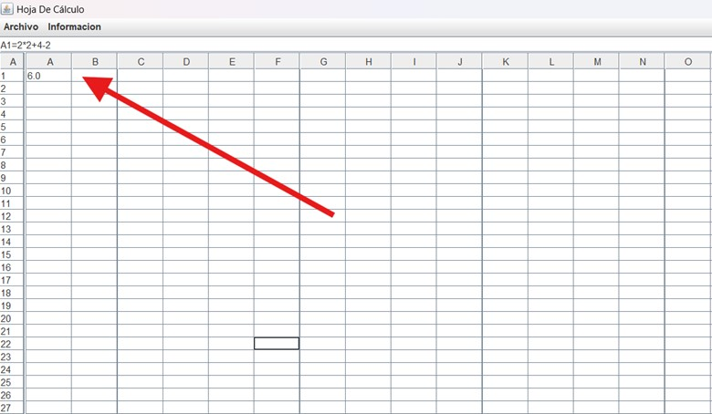
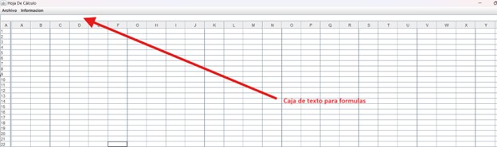
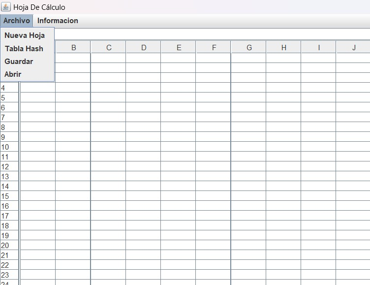
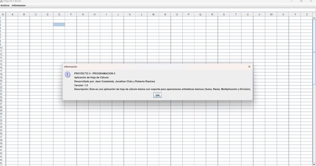
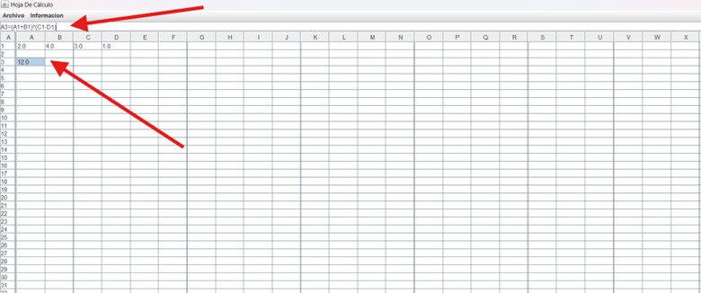
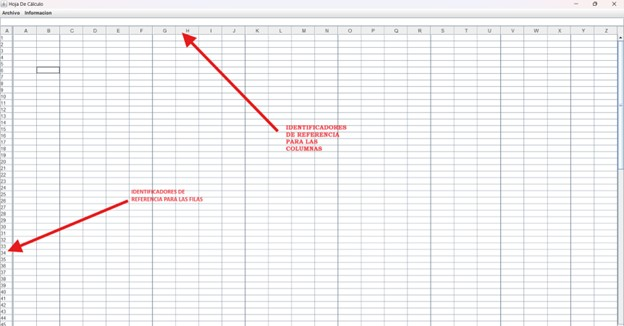
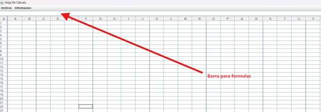
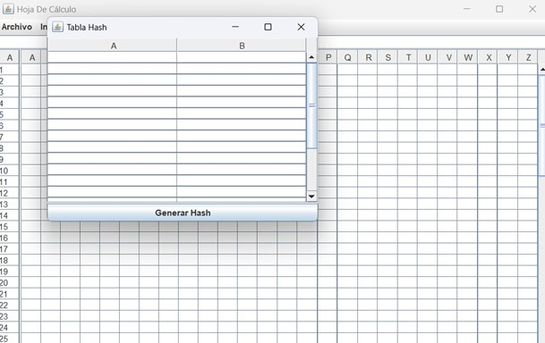
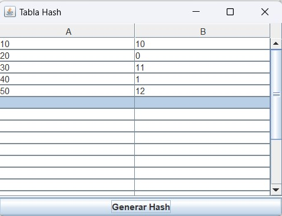
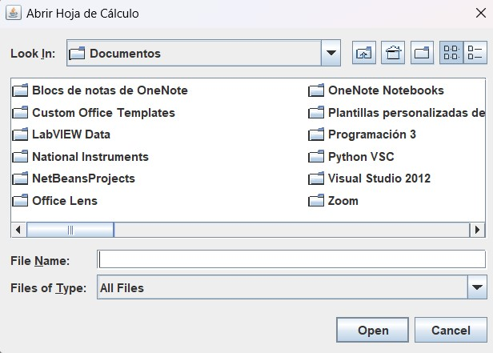

# **Proyecto 3 - Programación III**
---
---
### **Proyecto desarrollado por:**
#### Roberto Antonio Ramirez Gomez 7690-22-12700

#### Jean Klaus Castañeda Santos 7690-22-892

#### Jonathan Joel Chan Cuellar 7690-22-1805
---
[ENLACE A MANUAL TÉCNICO DEL PROYECTO](https://github.com/rramirezg18/Proyecto-3-Programacion-3/blob/main/Manual%20T%C3%A9cnico.md)
---
---
# Manual de Usuario: Proyecto Hoja de Cálculo

## Introducción
Bienvenido al Manual de Usuario del Proyecto Hoja de Cálculo. Este documento te guiará a través de las funcionalidades de la aplicación, mostrándote cómo utilizarla de manera efectiva para crear y gestionar hojas de cálculo, introducir datos y realizar operaciones aritméticas.

---
---

## Requisitos del Sistema

---
---

Para ejecutar esta aplicación necesitas:
- Java Runtime Environment (JRE) versión 8 o superior instalado en tu sistema.
- Un sistema operativo compatible con Java (Windows, macOS, Linux).

---
---

## Instalación y Ejecución

---
---

Sigue estos pasos para instalar y ejecutar la aplicación:

1. **Descargar el Proyecto**:
   - Clona o descarga el repositorio del proyecto desde [URL del Repositorio].

---
---

2. **Abrir el Proyecto**:
   - Abre el proyecto en tu entorno de desarrollo Java favorito (por ejemplo, Eclipse, IntelliJ IDEA).
   
---
---

3. **Compilar y Ejecutar**:
   - Compila y ejecuta la clase `Proyecto3Programacion3` para iniciar la aplicación.
   
---
---

## Uso de la Aplicación

---
---

### Interfaz Principal

---
---

Al iniciar la aplicación, se abre la ventana principal con la interfaz gráfica que contiene:

- **Barra de Fórmulas**: Una caja de texto en la parte superior donde puedes introducir o editar fórmulas.
- **Tabla de Datos**: Una tabla de 100 filas y 26 columnas (A-Z) donde puedes introducir datos y fórmulas.
- **Menú**: Un menú con opciones para gestionar el archivo, crear nuevas hojas, guardar y cargar datos, y mostrar información adicional.
- 
---
---

---
---

### Barra de Fórmulas
La barra de fórmulas permite introducir y editar el contenido de las celdas seleccionadas. Puedes escribir directamente en la barra y presionar "Enter" para actualizar la celda seleccionada con el nuevo contenido.

---
---

---
---

### Menú

---
---

#### Menú Archivo
- **Nueva Hoja**: Crea una nueva hoja de cálculo vacía.
- **Tabla Hash**: Abre una ventana que permite gestionar una tabla hash para almacenamiento de datos.
- **Guardar**: Guarda el contenido actual de la hoja de cálculo en un archivo.
- **Cargar**: Carga una hoja de cálculo previamente guardada desde un archivo.

---
---

---
---
 

#### Menú Información

---
---

- **Mostrar Información**: Muestra información adicional sobre la aplicación y sus desarrolladores.

---
---

---
---

### Operaciones Básicas

---
---

#### Introducción de Datos
1. Haz clic en una celda de la tabla.
2. Escribe el valor o fórmula en la barra de fórmulas.
3. Presiona "Enter" para guardar el valor en la celda seleccionada.

----
----

---
---

#### Edición de Datos

---
---
1. Selecciona la celda que deseas editar.
2. Escribe el nuevo valor o fórmula en la barra de fórmulas.
3. Presiona "Enter" para actualizar la celda.

---
---

---
---

#### Navegación por la Tabla

---
---
- Usa las flechas del teclado para moverte entre las celdas.
- Usa el ratón para seleccionar celdas directamente.

---
---

---
---

#### Operaciones Matemáticas

---
---

La aplicación permite realizar operaciones matemáticas básicas utilizando fórmulas. Para introducir una fórmula:
1. Selecciona una celda.
2. Escribe la fórmula en la barra de fórmulas (por ejemplo, `=A1+B2`).
3. Presiona "Enter" para calcular y mostrar el resultado en la celda seleccionada.

---
---

---
---

### Gestión de Tablas Hash

---
---

---
---

La aplicación incluye una funcionalidad de tablas hash para almacenar y buscar datos eficientemente.

#### Insertar Datos en la Tabla Hash

---
---

1. Selecciona la opción "Tabla Hash" en el menú "Archivo".
2. Introduce la clave a insertar.
3. El sistema calculará el índice de la clave y la almacenará en la posición correspondiente.

---
---

---
---

#### Buscar Datos en la Tabla Hash
1. Selecciona la opción "Tabla Hash" en el menú "Archivo".
2. Introduce la clave a buscar.
3. El sistema buscará la clave en la tabla hash y mostrará el índice si la encuentra, o -1 si no la encuentra.

---
---

---
---

## Solución de Problemas
- **La aplicación no se ejecuta**: Asegúrate de tener Java instalado y configurado correctamente.
- **Error al guardar o cargar archivos**: Verifica los permisos de lectura/escritura en el directorio de destino.
- **Fórmulas no se calculan correctamente**: Asegúrate de que las referencias de celdas y las fórmulas estén correctamente escritas.

---
---

---
---

Esperamos que este manual te ayude a aprovechar al máximo todas las funcionalidades de la aplicación. ¡Gracias por usar nuestro proyecto de Hoja de Cálculo!

---
---

